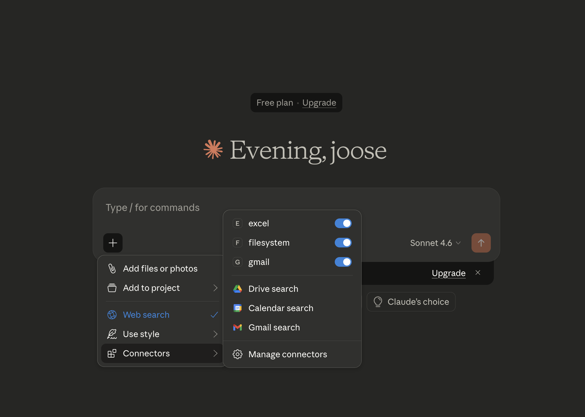
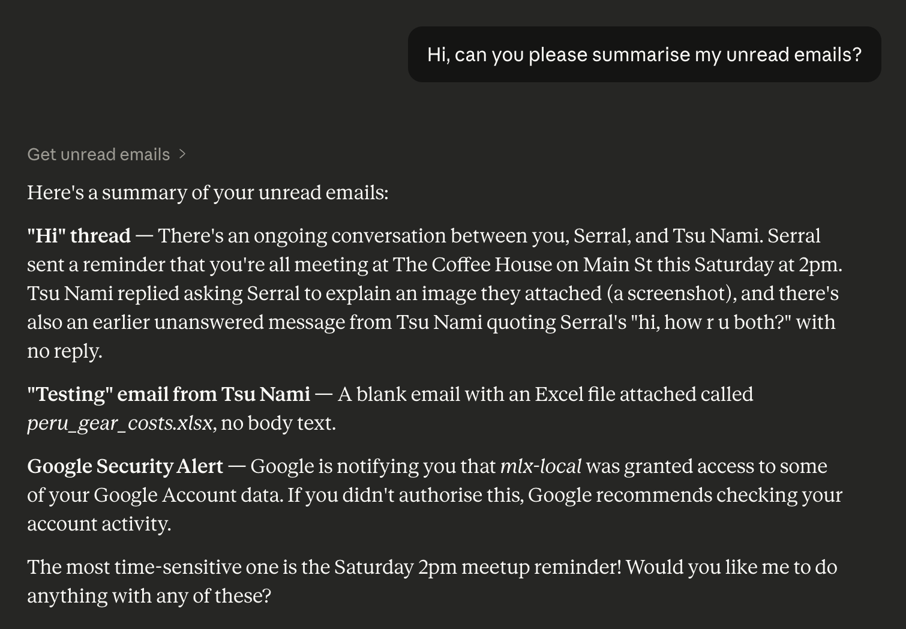
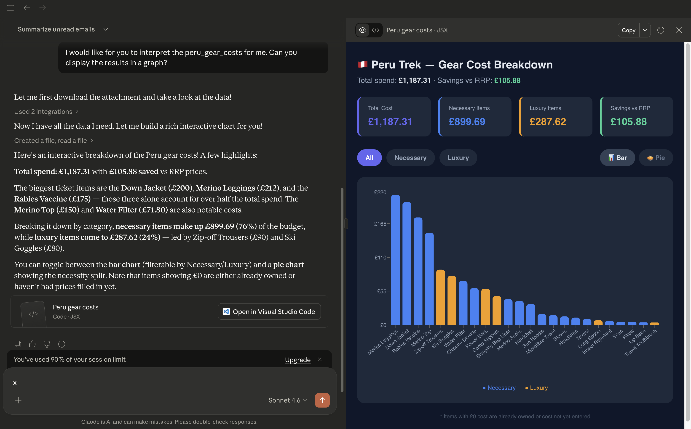
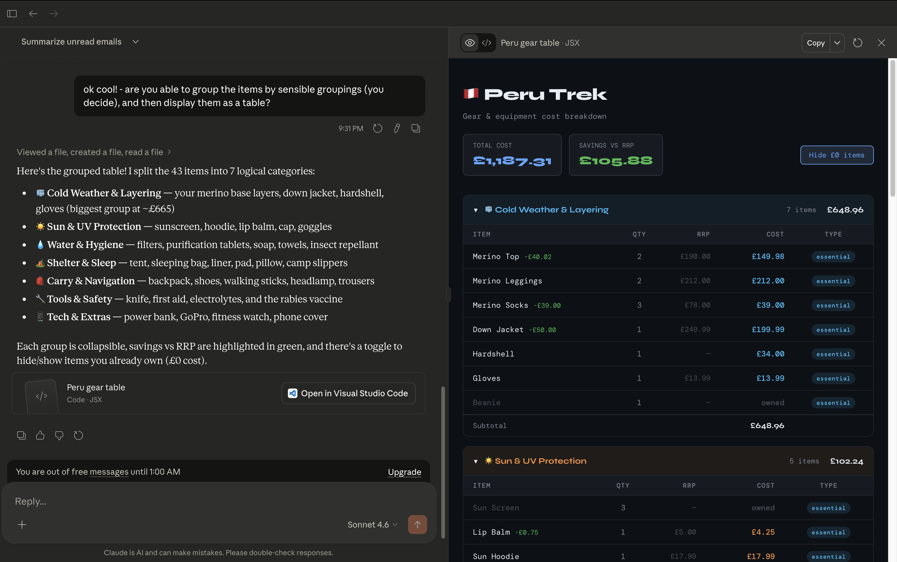
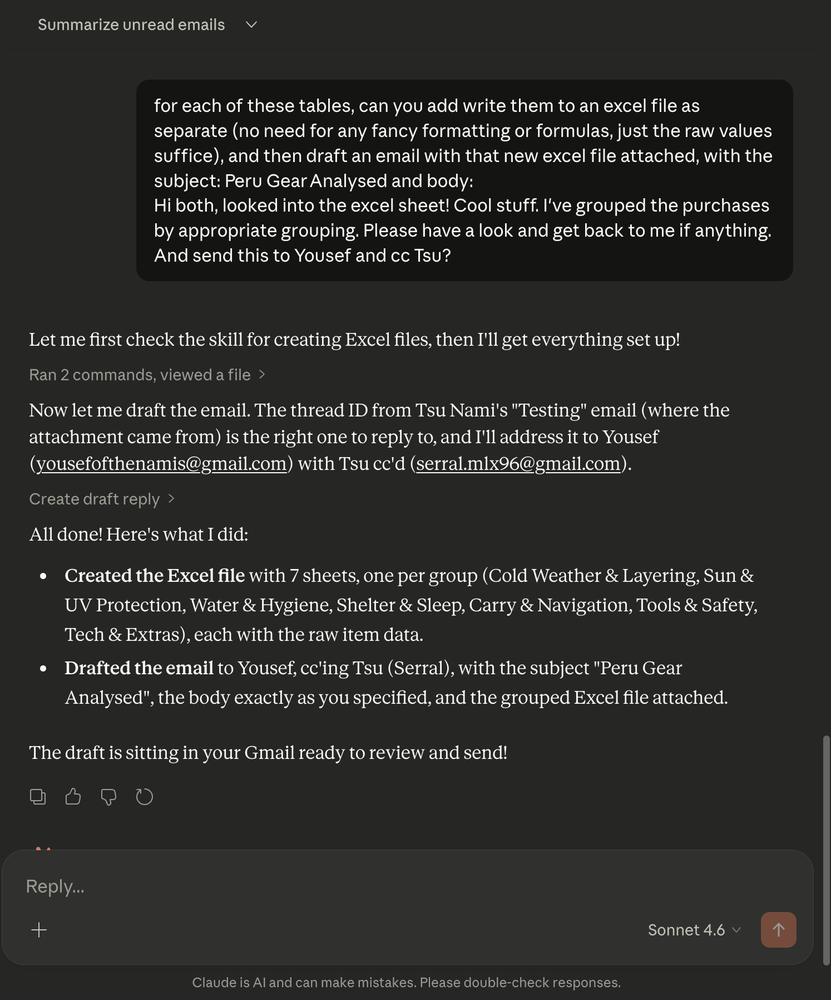
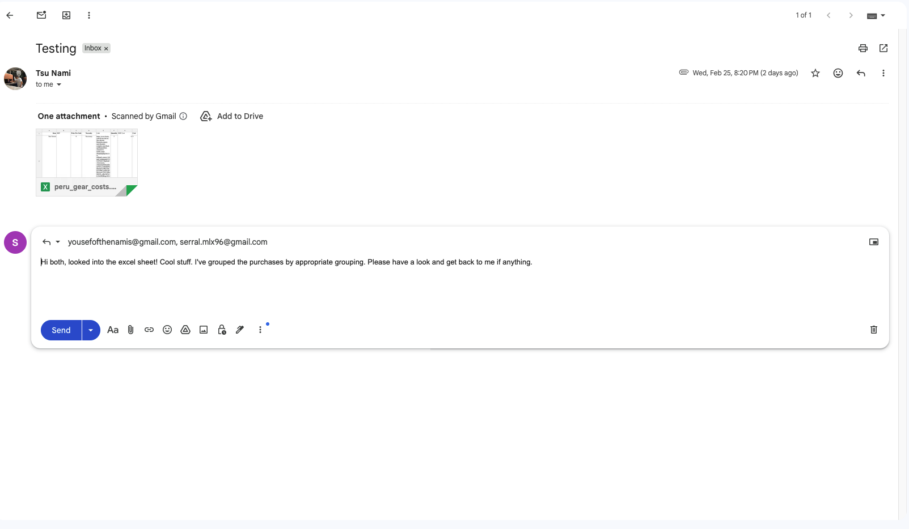
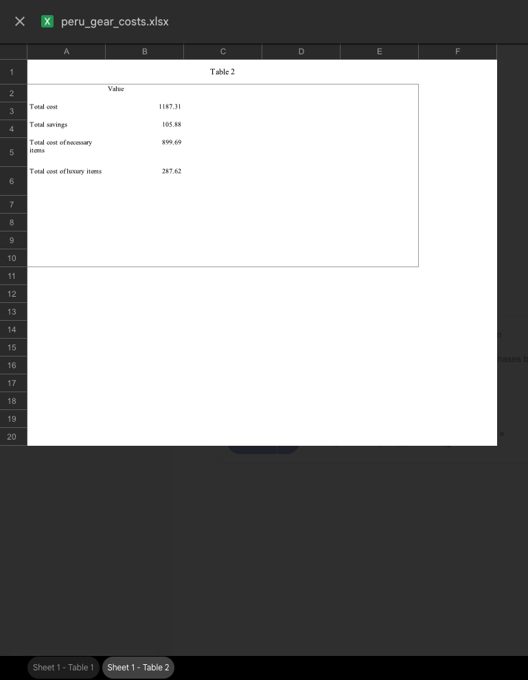

# GMail MCP Server

This project connects Claude Desktop with a custom built GMail MCP server that supports the following tools:
- get_unread_emails
- get_message_attachments
- create_draft_reply

With connections to other MCP servers, such as [filesystem](https://github.com/modelcontextprotocol/servers/tree/main/src/filesystem) and [excel-mcp-server](https://github.com/negokaz/excel-mcp-server), Claude can be used to:
- download excel attachments from emails, and interpret the results
- generate new sheets (basic sheets only) and upload them to draft emails
- download image attachments from emails, and interpret them

# Setup

## Pre-requisites
- You'll need Claude downloaded
- You'll need a python installed
- You'll need a Google developer account with OAuth setup

## Create virtual environment and install requirements
In your virtual env, run the following command
```python
pip install -r requirements.txt
```
This will install the required packages. The package that is used for interacting with Gmail is one of my personal packages, [in-n-out-clients](https://github.com/namiyousef/in-n-out-clients). The code for the email client was generated using copilot to speed development up.

Once this is done, confirm that you are able to run the code:
```python
python src/main.py
```

You should see an output like this:
```
DEBUG:mcp.server.lowlevel.server:Initializing server 'gmail'
DEBUG:mcp.server.lowlevel.server:Registering handler for ListToolsRequest
DEBUG:mcp.server.lowlevel.server:Registering handler for CallToolRequest
DEBUG:mcp.server.lowlevel.server:Registering handler for ListResourcesRequest
DEBUG:mcp.server.lowlevel.server:Registering handler for ReadResourceRequest
DEBUG:mcp.server.lowlevel.server:Registering handler for PromptListRequest
DEBUG:mcp.server.lowlevel.server:Registering handler for GetPromptRequest
DEBUG:mcp.server.lowlevel.server:Registering handler for ListResourceTemplatesRequest
DEBUG:asyncio:Using selector: KqueueSelector
```

## Configure Claude to connect to MCP servers
Modify your claude_desktop_config.json to contain the following. Modify the paths as appropriate
```json
{
    "mcpServers": {
        "gmail": {
            "command": "{PATH_TO_VENV}/bin/python",
            "args": [
                "{PATH_TO_REPOSITORY}/src/main.py"
            ],
            "env": {
                "PATH": "{PATH_TO_VENV}/bin:/usr/local/bin:/usr/bin:/bin",
                "GOOGLE_OAUTH_TOKEN": "{PATH_TO_GOOGLE_OAUTH_JSON}"
            }
        },
        "filesystem": {
            "command": "npx",
            "args": [
                "-y",
                "@modelcontextprotocol/server-filesystem",
                "/tmp/"
            ]
        },
        "excel": {
                "command": "npx",
                "args": ["--yes", "@negokaz/excel-mcp-server"],
                "env": {
                    "EXCEL_MCP_PAGING_CELLS_LIMIT": "4000"
                }
            }
    },
    "preferences": {
        "coworkScheduledTasksEnabled": false,
        "sidebarMode": "chat",
        "coworkWebSearchEnabled": true
    }
}
```

# End-to-end Example

## Confirm Setup is fine
I'm going through this having following the setup.
I started claude, and confirmed that the 3 tools are available by clicking the plus icon and looking for "connectors"


## Ask to get unread emails

Here, claude uses the `get_unread_emails` tool to read the emails

## Ask to get attachment, and interpret results


Here, claude uses the `get_message_attachments` tool to get the excel file.
However, because the MCP server runs locally on your machine, the file won't be accessible to claude by default. The tools from the `excel-mcp-server` allow claude to read the results. It then uses other tools to generate plots/graphics

## Ask to modify the results


Here claude uses other tools at its disposal to interpret the results

## Draft an email





Claude uses tools from the `excel-mcp-server` to write data into excel files on your local machine. Then the `create_draft_reply` tool from the custom GMail MCP server is used to create the draft.

